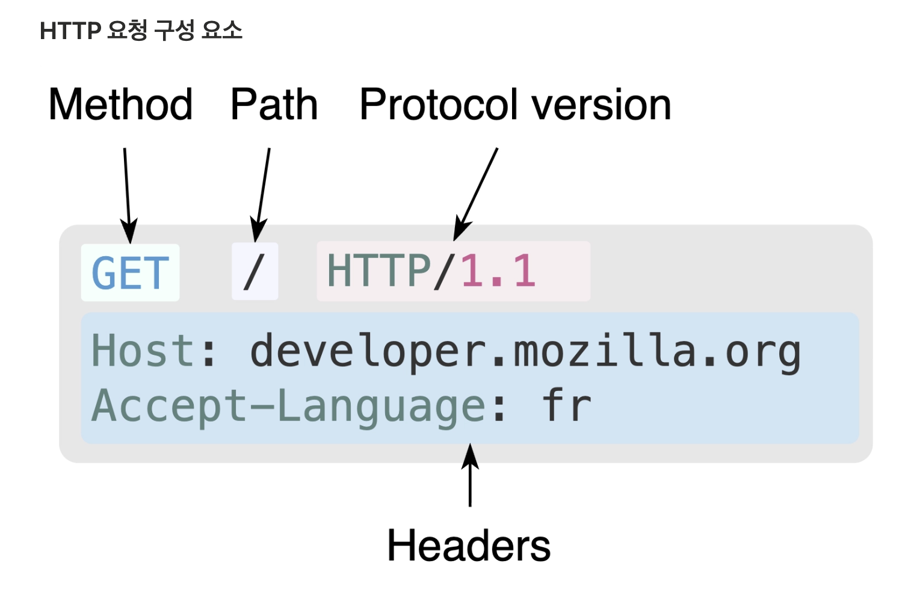

# HTTP & HTTPS

## 학습 목표

- HTTP와 HTTPS를 비교하여 설명할 수 있다.

---

## HTTP (Hypertext Transfer Protocol)

클라이언트와 서버 간의 통신을 위한 규칙이다.

- OSI 모델의 애플리케이션 계층 프로토콜
- 웹에서 이루어지는 모든 데이터 교환의 기초

### 특징

- 주로 HTML 문서를 포함한 하이퍼미디어(이미지, 비디오, 스타일시트 등)를 주고받는 데 사용된다.
- TCP 혹은 암호화된 TCP 연결인 TLS를 통해 전송되며, 80번 포트를 사용한다.

**Stateless (무상태)**

- HTTP는 상태를 저장하지 않는다. == 서버가 이전 요청을 기억하지 않는다.
- ⇒ 쿠키를 통해 보완 가능하다.
    - 쿠키(HTTP Cookie)란?
    - 서버가 사용자의 웹 브라우저에 전송하는 작은 데이터 조각
    - HTTP에서 클라이언트의 상태 정보를 PC에 저장했다가, 필요 시 정보를 참조하거나 재사용할 수 있다.

**Connectionless (비연결)**

- 클라이언트가 요청을 서버에 보내고, 서버가 적절한 응답을 클라이언트에 보내면, 즉시 연결이 끊긴다.

예시

```
1번째 요청: "셔츠 페이지 보여줘"
   ↓
2번째 요청: "이 셔츠를 장바구니에 넣어줘"
   ↓
3번째 요청: "내 장바구니에 뭐가 들어있어?"

HTTP(Stateless) 입장

1번째: "어떤 셔츠야?" (context 없음)
2번째: "누구의 장바구니?" (이전 요청을 모름)
3번째: "당신 장바구니가 뭔데?" (1번, 2번 요청을 기억 안 함)
```

#### HTTP는 UDP를 사용할까?

=> HTTP는 UDP를 사용하지 않는다.

- 연결은 전송 계층에서 제어되므로, 근본적으로 HTTP 영역 밖이다.
- HTTP는 신뢰할 수 있거나, 메시지 손실이 없는 연결을 요구한다.
- 따라서, HTTP는 연결이 필수는 아니지만, 연결 기반인 TCP 표준에 의존한다.


### HTTP 요청 구성 요소



#### Method

클라이언트가 수행하고자 하는 동작을 정의한다. (서버에게 뭘 하라고 할 건지?)

| 메서드 | 의도                      | 예시                  |
| --- |-------------------------|---------------------|
| **GET** | 리소스를 읽기만 함              | 웹 페이지 보기, 이미지 다운로드  |
| **POST** | 서버에 데이터를 보내서 처리 요청      | 로그인 폼 제출, 댓글 작성     |
| **PUT** | 리소스를 통째로 교체             | 회원 정보 전체 수정         |
| **PATCH** | 리소스를 일부만 수정             | 비번만 변경              |
| **DELETE** | 리소스를 삭제                 | 게시글 삭제              |
| **HEAD** | GET 요청과 동일하지만, 응답 본문 제외 | 메타데이터 확인, 리소스 존재 확인 |
| **OPTIONS** | 서버가 지원하는 메서드 확인         | 통신 가능 여부 확인         |


#### Path
가져오려는 리소스의 경로로, 전체 URL에서 도메인과 포트를 제거한 것이다. (서버의 어느 리소스를 원하는지?)

```
전체 URL:  https://developer.mozilla.org:443/en-US/docs/Web/HTTP
          ↓ 도메인, 포트 제거
Path: /en-US/docs/Web/HTTP
```

#### Protocol Version

HTTP의 버전을 나타낸다. (HTTP/1.1, HTTP/2, HTTP/3 등)


### HTTP 상태 코드란?
- 클라이언트가 보낸 HTTP 요청이 성공했는지 실패했는지를 서버에서 알려주는 3자리 숫자 코드다.
- 1XX: 정보 응답. 요청이 수신되어 처리 중 (예: 100 Continue)
- 2XX: 성공 응답. 요청이 정상 처리되고, 성공함 (예: 200 OK, 201 Created)
- 3XX: 리다이렉션. 요청을 완료하려면 추가 행동이 필요 (예: 301 Moved Permanently, 304 Not Modified)
- 4XX: 클라이언트 오류. 잘못된 문법, 인증 실패 등으로 서버가 요청을 수행할 수 없음 (예: 400 Bad Request, 404 Not Found, 401 Unauthorized)
- 5XX: 서버 오류. 서버가 유효한 요청을 처리하지 못함 (예: 500 Internal Server Error, 503 Service Unavailable)

### HTTP의 문제점은?

1. 평문 통신 => 도청 가능
    - HTTP는 암호화되지 않은 평문으로 통신하므로, 중간에 정보를 탈취당할 수 있다.
    - 보완: HTTPS(TLS 암호화) 사용


2. 통신 상대 인증 X => 위장 가능
   - 서버가 클라이언트의 신원을 확인할 수 없고, 클라이언트가 서버의 신원을 확인할 수 없다.
   - DoS 공격, 중간자 공격 등의 위험이 있다.
   - 보완: SSL/TLS 증명서를 통한 상대 확인


3. 통신 내용 변조 가능 => 완전성 미보장
   - 전송 중 데이터가 변조되어도 이를 감지할 수 없다.
   - 이와 같이, 공격자가 도중에 리퀘스트나 리스폰스를 빼앗아 변조하는 공격을 중간자 공격이라 한다.
   - 보완: HTTPS 사용, 암호화와 디지털 서명

---

## HTTPS (Hypertext Transfer Protocol Secure)

HTTP의 안전한 버전이다.

- HTTPS는 새로운 애플리케이션 계층 프로토콜이 아니라, HTTP 통신하는 소켓 부분을 SSL(Secure Socket Layer) 혹은 TLS(Transport Layer Security) 프로토콜로 대체한 것이다.
- HTTP는 원래 TCP와 직접 통신했지만, HTTPS에서 HTTP는 SSL과 통신하고, SSL이 TCP와 통신한다.
- SSL을 사용한 HTTPS는 암호화와 증명서, 안정성 보호를 이용할 수 있게 된다.

#### HTTP vs HTTPS 구조

```
HTTP: 애플리케이션 계층(HTTP) → 전송 계층(TCP) → 네트워크 계층
HTTPS: 애플리케이션 계층(HTTP) → SSL/TLS → 전송 계층(TCP) → 네트워크 계층
```

### HTTPS의 보안 특징

- 암호화된 통신
- 서버 인증 (인증서)
- 데이터 무결성 보장

### 암호 시스템

- HTTPS의 SSL/TLS는 하이브리드 암호 시스템을 사용한다.
- 공개키 암호화 방식으로 대칭키(공통키)를 안전하게 교환
- 이후 통신에서는 대칭키로 데이터를 빠르게 암호화

### HTTP와 비교했을 때, HTTPS의 장점은?

#### 보안

- HTTP
    - 메시지가 일반 텍스트로 전송됨
    - 권한이 없는 사람도 쉽게 데이터를 가로챌 수 있음


- HTTPS
    - 모든 데이터를 암호화된 형태로 전송 
    - 데이터를 가로쳐도 해독 불가능 
    - 인증서를 통해 서버의 신뢰성 검증

#### 성능

- HTTPS 웹 애플리케이션은 HTTP보다 더 빠른 로드 속도를 제공한다.
- HTTPS는 참조 링크를 더 잘 추적할 수 있다.
    - 광고나 소셜 미디어에서 들어오는 트래픽의 출처를 더 정확하게 기록 가능하다.

### 모든 웹 페이지에서 HTTPS를 사용해도 될까?

암호화 통신은 평문 통신보다 더 많은 리소스(CPU, 메모리)를 요구한다.

통신할 때마다 암호화를 하면, 추가적인 리소스를 소비하기 때문에, 서버 한 대당 처리할 수 있는 리퀘스트의 수가 상대적으로 줄어들게 된다.

하지만, 최근에는 하드웨어의 발달로 인해 HTTPS를 사용하더라도 속도 저하가 거의 일어나지 않는다.

새로운 표준인 HTTP 2.0을 함께 이용한다면, 오히려 HTTPS가 HTTP보다 더 빠르게 동작한다. 

따라서, 웹은 과거의 민감한 정보를 다룰 때만 HTTPS에 의한 암호화 통신을 사용하는 방식에서, 현재 모든 웹 페이지에서 HTTPS를 적용하는 추세다.


### 참고 자료
- [MDN - HTTP 개요](https://developer.mozilla.org/ko/docs/Web/HTTP/Guides/Overview)
- [MDN - HTTP 요청 메서드](https://developer.mozilla.org/ko/docs/Web/HTTP/Reference/Methods)
- [MDN - HTTP 상태 코드](https://developer.mozilla.org/ko/docs/Web/HTTP/Reference/Status)
