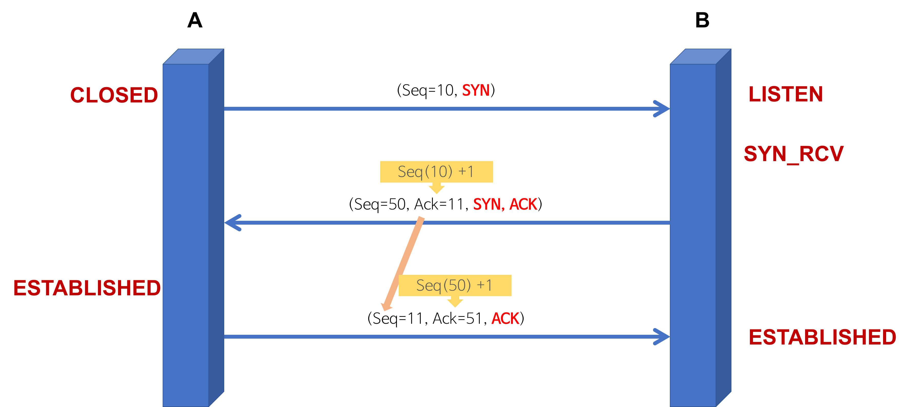

## TCP 3 way handshake & 4 way handshake

### TCP 연결 설정, 해제

TCP는 통신하는 양쪽 프로세스 사이에 연결을 설정/해제하여 신뢰성을 보장하는 **연결형 서비스**이다.

- 3-way handshaking 과정을 통해 연결을 설정
- 4-way handshaking 을 통해 연결을 해제

### TCP 3 way handshake

통신하기에 앞서 TCP 연결을 설정하는 과정이다.

#### 용어 설명

- 플래그 비트 : TCP 헤더에 있는 제어용 비트이다. 특정 비트를 1로 설정해서 SYN, ACK 같은 의미를 나타낸다.

  - SYN(Synchronize) : TCP 연결을 시작할 때 사용하는 플래그

  - ACK(Acknowledgement) : 상대방의 요청이나 데이터를 잘 받았다는 것을 알려주는 플래그

- 연결 상태

  - CLOSED : TCP 연결이 없는 초기 상태이다.

  - LISTEN : 서버가 특정 포트에서 클라이언트의 연결 요청을 기다리는 상태이다.

  - SYN_SENT : 클라이언트가 서버에게 SYN을 보내고, 서버의 SYN + ACK 응답을 기다리는 상태이다.

  - SYN_RECEIVED : 서버가 클라이언트의 SYN을 받고 SYN + ACK를 보낸 뒤, 클라이언트의 ACK를 기다리는 상태이다.

  - ESTABLISHED : 3 way handshake가 완료되어 클라이언트와 서버가 데이터를 주고받을 수 있는 상태이다.

#### 연결 상태 변화

| 단계 | 통신 과정 | 클라이언트 상태 | 서버 상태 |
| --- | --- | --- | --- |
| 시작 전 | 아직 연결 요청 전 | CLOSED | LISTEN |
| 1단계 | 클라이언트 → 서버 : SYN | CLOSED → SYN_SENT | LISTEN |
| 2단계 | 서버 → 클라이언트 : SYN + ACK | SYN_SENT | LISTEN → SYN_RECEIVED |
| 3단계 | 클라이언트 → 서버 : ACK | SYN_SENT → ESTABLISHED | SYN_RECEIVED |
| 완료 | 서버가 ACK를 받음 | ESTABLISHED | SYN_RECEIVED → ESTABLISHED |

1. 클라이언트 → 서버 : SYN
   - 동작 : 클라이언트가 서버에게 SYN을 보낸다.
   - 의미 : TCP 연결을 시작하겠다는 요청이다.
   - Sequence Number : 랜덤 숫자
   - 연결 상태
      - 클라이언트: CLOSED → SYN_SENT
      - 서버: LISTEN

2. 서버 → 클라이언트 : SYN + ACK
   - 동작 : 서버는 SYN + ACK를 보낸다.
   - 의미 : 서버가 클라이언트의 SYN을 잘 받았다는 의미로 ACK를 보내고, 서버도 연결을 시작하겠다는 의미로 SYN을 함께 보낸다.
   - Acknowledgement Number : 클라이언트의 Sequence Number + 1
   - Sequence Number : 서버가 생성한 랜덤 숫자
   - 연결 상태
      - 클라이언트: SYN_SENT
      - 서버: LISTEN → SYN_RECEIVED

3. 클라이언트 → 서버 : ACK
   - 동작 : 클라이언트가 ACK를 보낸다.
   - 의미 : 클라이언트가 서버의 SYN을 잘 받았다는 의미이다.
   - Acknowledgement Number : 서버의 Sequence Number + 1
   - 결과 : ACK를 보낸 뒤 클라이언트는 ESTABLISHED 상태가 되고, 서버도 ACK를 받으면 ESTABLISHED 상태가 된다.
   - 연결 상태
      - 클라이언트: SYN_SENT → ESTABLISHED
      - 서버: SYN_RECEIVED → ESTABLISHED

### TCP 4 way handshake

통신이 끝나고 TCP 연결을 해제하는 과정이다.

아래 예시는 클라이언트가 먼저 연결 종료를 요청하는 경우이다. 클라이언트가 먼저 “나는 더 이상 보낼 데이터가 없다”라고 알리고, 서버도 남은 데이터를 모두 보낸 뒤 “나도 더 이상 보낼 데이터가 없다”라고 알려야 TCP 연결이 안전하게 종료된다.

#### 용어 설명

- 플래그 비트 : TCP 헤더에 있는 제어용 비트이다. 특정 비트를 1로 설정해서 ACK, FIN 같은 의미를 나타낸다.

  - FIN(Finish) : TCP 연결을 종료하고 싶을 때 사용하는 플래그

  - ACK(Acknowledgement) : 상대방의 요청이나 데이터를 잘 받았다는 것을 알려주는 플래그

- 연결 상태

  - ESTABLISHED : 클라이언트와 서버가 데이터를 주고받을 수 있는 상태이다.

  - FIN_WAIT_1 : 먼저 연결 종료를 요청한 쪽이 FIN을 보내고, 상대방의 ACK를 기다리는 상태이다.

  - FIN_WAIT_2 : 먼저 연결 종료를 요청한 쪽이 FIN에 대한 ACK를 받은 뒤, 상대방의 FIN을 기다리는 상태이다.

  - CLOSE_WAIT : 연결 종료 요청을 받은 쪽이 FIN을 받고 ACK를 보낸 뒤, 애플리케이션의 종료 처리를 기다리는 상태이다.

  - LAST_ACK : 연결 종료 요청을 받은 쪽이 남은 데이터를 모두 처리한 뒤 FIN을 보내고, 상대방의 ACK를 기다리는 상태이다.

  - TIME_WAIT : 먼저 연결 종료를 요청한 쪽이 상대방의 FIN에 대한 ACK를 보낸 뒤, 일정 시간 동안 대기하는 상태이다.

  - CLOSED : TCP 연결이 완전히 종료된 상태이다.

#### 연결 상태 변화

| 단계 | 통신 과정 | 클라이언트 상태 | 서버 상태 |
| --- | --- | --- | --- |
| 시작 전 | 데이터 송수신 중 | ESTABLISHED | ESTABLISHED |
| 1단계 | 클라이언트 → 서버 : FIN | ESTABLISHED → FIN_WAIT_1 | ESTABLISHED |
| 2단계 | 서버 → 클라이언트 : ACK | FIN_WAIT_1 → FIN_WAIT_2 | ESTABLISHED → CLOSE_WAIT |
| 3단계 | 서버 → 클라이언트 : FIN | FIN_WAIT_2 | CLOSE_WAIT → LAST_ACK |
| 4단계 | 클라이언트 → 서버 : ACK | FIN_WAIT_2 → TIME_WAIT | LAST_ACK |
| 완료 | 일정 시간 후 연결 종료 | TIME_WAIT → CLOSED | LAST_ACK → CLOSED |

1. 클라이언트 → 서버 : FIN
   - 동작 : 클라이언트가 서버에게 FIN을 보낸다.
   - 의미 : 클라이언트가 더 이상 보낼 데이터가 없다는 의미이다.
   - 결과 : 클라이언트는 연결 종료 요청을 보낸 뒤, 서버의 응답을 기다린다.
   - 연결 상태
      - 클라이언트: ESTABLISHED → FIN_WAIT_1
      - 서버: ESTABLISHED

2. 서버 → 클라이언트 : ACK
   - 동작 : 서버는 ACK를 보낸다.
   - 의미 : 서버가 클라이언트의 연결 종료 요청을 확인했다는 의미이다.
   - 결과 : 서버는 아직 보낼 데이터가 남아 있을 수 있으므로 바로 연결을 종료하지 않는다.
   - 연결 상태
      - 클라이언트: FIN_WAIT_1 → FIN_WAIT_2
      - 서버: ESTABLISHED → CLOSE_WAIT

3. 서버 → 클라이언트 : FIN
   - 동작 : 서버도 클라이언트에게 FIN을 보낸다.
   - 의미 : 서버도 더 이상 보낼 데이터가 없다는 의미이다.
   - 결과 : 서버가 연결 종료 준비를 마쳤음을 클라이언트에게 알린다.
   - 연결 상태
      - 클라이언트: FIN_WAIT_2
      - 서버: CLOSE_WAIT → LAST_ACK

4. 클라이언트 → 서버 : ACK
   - 동작 : 클라이언트가 ACK를 보낸다.
   - 의미 : 클라이언트가 서버의 연결 종료 요청을 확인했다는 의미이다.
   - 결과 : 서버는 ACK를 받은 뒤 연결을 종료하고, 클라이언트는 일정 시간 동안 TIME_WAIT 상태로 대기한 뒤 연결을 완전히 종료한다.
   - 연결 상태
      - 클라이언트: FIN_WAIT_2 → TIME_WAIT → CLOSED
      - 서버: LAST_ACK → CLOSED
